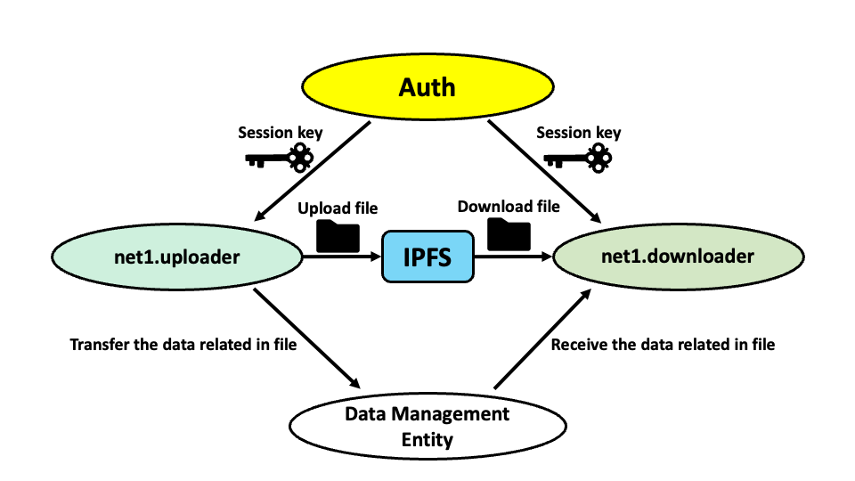
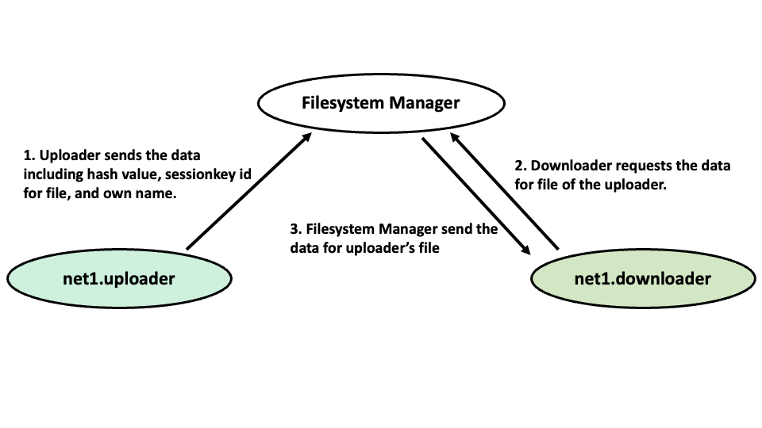

# Overview
---
This directory includes descriptions for file sharing and file_system_manager.py which manages session key IDs, file hash values, and purposes of file sharing.

# Example details
---

The figure above illustrates the example with Auths (*Auth*), their example entities and the file system manager. *Auth* is an authorization entity for network 1 (net1), and it has two registered entities, namely, *net1.uploader* and *net1.downloader*. The file system manager manages the information for files.

Auth provides the secure session key with net1.uploader and net1.downloader according to communication policy. If net1.uploader gets the session key from Auth, net1.uploader can encrypt the file with the session key. Then, net1.uploader uploads the encrypted file to IPFS. IPFS is a decentralized distributed file system and everyone can download the file using hash value. When net1.uploader uploads the file, net1.uploader transfers the data including file hash value, session key ID, and purpose to the file system manager. However, if net1.downloader is not registered in the file_sharing_info table, we can request 'Addreader' to Auth through the 'addReader.txt' file.

net1.downloader requests the file information to the file system manager. The file system manager confirms the net1.downloader and gives the file information. 
net1.downloader checks if there is a key that fits the session key ID, and if not, requests the session key from Auth. net1.downloader who received the session key from Auth downloads the encrypted file from IPFS and decrypts the file using the session key.

# File system manager
The file system manager is an entity that manages detailed information about files registered in IPFS. When a file is uploaded to IPFS, the file appears only as a hash value, with no other information. However, when a person wants to give files only to certain people, he or she must use hash values and other information to block access to others. The way to block other people's access can be blocked if Auth does not provide a session key. However, another entity is required to obtain information on the session key. Therefore, the file system manager stores session keys and purposes according to hash values together to provide this information when a specific entity requests information. Details are below.

# How to run examples
---
For this section, we use *$ROOT* for the root directory of this repository.

### To generate credentials for example Auths and entities, and to create example Auth databases
Change the directory to _$_ROOT/examples*.

2. Run the script *generateAll.sh*, by entering './generateAll.sh -g configs/file_sharing.graph'.

3. You will be prompted to enter a password for keystores of Auths. Enter your password to proceed.

4. If there is any error or you want to start with a clean copy, you can delete all generated credentials and Auth databases by running the script *cleanAll.sh*, with the command './cleanAll.sh'.

### To run IPFS (in command line)
1. Run 'ipfs daemon' to activate an IPFS environment. (IPFS command line tools should be installed a priori. If it is not installed, then you can install it easily by reading [IPFS install](https://docs.ipfs.tech/install/command-line/#install-official-binary-distributions)).

### To run example Auths (in command line)
See README.md under *examples/* for details.
1. Change directories $ROOT/auth/auth-server/.

2. Run 'mvn clean install' to build an executable jar file.

3. Run the jar file with the properties file for Auth101, with 'java -jar target/auth-server-jar-with-dependencies.jar -p ../properties/exampleAuth101.properties'.

4. Enter your password to proceed.

### To run an example file system manager

1. Change directories to *$ROOT/examples/file_sharing/*.

2. Run 'python3 file_system_manager.py' to execute the file system manager.

### To run example entities written in C language
See README.md under *entity/c/* for details.

1. Run 'git submodule update --remote' to move the IPFS submodule for file sharing.

2. Change directories to *$ROOT/entity/c/ipfs_examples/*

3. Run 'mkdir build && cd build'

4. Run 'cmake ../' to make the Makefile to build.

5. Run 'make' 

6. Run './entity_downloader ../downloader.config', to execute net1.downloader.

7. Run './entity_uploader ../uploader.config ../plain_text.txt ../addReader.txt' in a separate terminal, to execute net1.uploader.

# Security for File System Manager
---

File System Manager manages the information for the file such as file hash value, session key ID, and provider info. If someone attacks File System Manager and knows the information, this information can be used in either way. Therefore, we need to enhance the security of the file system manager. 

According figure above, net1.uploader and net1.downloader receive the session key from Auth respectively. File System Manager requests the session key using session key id to Auth (For more detail, you can see process through communication between entity client and server from *$ROOT/entity/c/*.) Thanks to secure key received from Auth, File System Manager can manage the information for the file. Also, We add Auth's communication policy and implement the code for security as Python API in *$ROOT/entity/python/*.

To manages effectively the information for files, we make the database using SQLite and Python API in *$ROOT/entity/python/*. This database saves two tables which are file metadata table and record metadata table. To apply security to this database, we design the security using encryption for the database with the password which we inputs.

# How to run examples with security

For this section, we use *$ROOT* for the root directory of this repository.

### To generate credentials for example Auths and entities, and to create example Auth databases

The process is the same as the above example.

### To run IPFS (in command line)

The process is the same as the above example.

### To run example Auths (in command line)

The process is the same as the above example.

### To run an example file system manager with security

1. Change directories to *$ROOT/examples/file_sharing/*.

2. Run 'python3 secure_file_system_manager.py file_system_manager.config' to execute the file system manager.

3. Press the password for the database to get previous information.

### To run example entities written in C language

See README.md under *entity/c/* for details.

1. Run 'git submodule update --remote' to move the IPFS submodule for file sharing.

2. Change directories to *$ROOT/entity/c/ipfs_examples/*

3. Run 'mkdir build && cd build'

4. Run 'cmake ../' to make the Makefile to build.

5. Run 'make' 

6. Run './secure_entity_downloader ../secure_downloader.config', to execute net1.downloader.

7. Run './secure_entity_uploader ../secure_uploader.config ../plain_text.txt ../addReader.txt' in a separate terminal, to execute net1.uploader.
